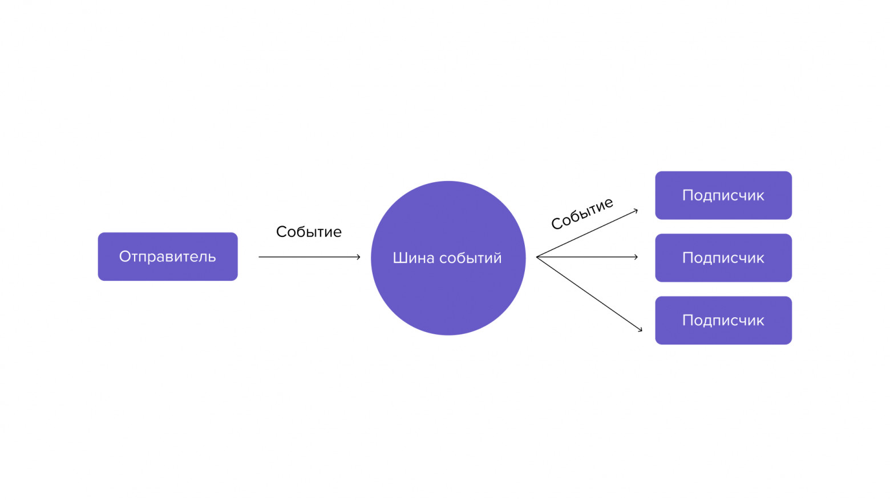

# Принцип работы программы
Главная задача много потока - отделить операции с хардваирной частью от софтваирной части,
поэтому все обращение к хардваиру и частичная его обработка вынесены в 3 потока:

* Контрол хаб
* Експеншион хаб
* Камера

Соединение софтварной части к хардварной происходит с помощью заранее созданного объекта HardwareLink.
Код делится на модули - один модуль привязан к одному физическому модулю 
(например Колесной базе соответствует модуль DriveTrain) модуль должен выполнять определенную четкую задачу.
Чтобы создать модуль надо создать класс, который будет реализовывать интерфейс IModule:

* process вызывается когда привязанный хардваирный поток обновляется и при этом модуль не занят.
(**Важно** учитывать что в этой функции должно быть как можно меньше операций, потому что скорость 
обработки этой функции должна быть быстрее ветка привязанного потока, поэтому советуется запустить
куратину которая уже будет делать чето долгое)
* isBusy - флаг о том что модуль занят вычислениями, поэтому он пропустит одно обновление привязанного хардварного потока
* dispose - вызывается тогда, когда происходит полный перезапуск робота - в этот момент надо
освободить все занятые ресурсы, которые могут создать утечку памяти/ утечку потока

Пример реализации:

```Kotlin
class MyModule: IModule {
    private var _currentJob: Job? = null //отслеживание текущей задачи

    override fun process() {
        _currentJob = ThreadManager.LAZY_INSTANCE.globalCoroutineScope.launch { //запрос и запуск куратины
            delay(1000) //долгое действие
        }
    }

    override val isBusy: Boolean
        get() = _currentJob != null && _currentJob!!.isCompleted //проверка на то что задача еще не закончена

    override fun dispose() {
        _currentJob?.cancel() //освобождение ресурсов
    }
}
```

Для того что, чтобы _привязать_ модуль к хардварному потоку и в целом сделать модуль активным надо в
классе [HardwareThreads](../TeamCode/src/main/kotlin/org/woen/threading/hardware/HardwareThreads.kt)
в методе initModules выбрать нужный хардварный поток, допустим CONTROL, обратится к его линковщику(.link)
и вызвать метод addModules, где через запятую перечислить инстанцы модулей

Пример:

```Kotlin
fun initModules() {
    CONTROL.link.addModules(MyModule())
}
```

Там же можно отключать включать модули.

---
# Вспомогательные системы
В проекте есть много вспомогательных систем: ThreadManager, HotRun, ThreadedTimers, ThreadedGamepad, ThreadedEventBus, ThreadedBattery, ThreadedTelemetry
все они реализованы с помощью LAZY_INSTANCE - их синглтон инстанц будет создан при первом обращении к нему.
Ро названию систем понятно что они потокобезопасны, можно использовать где угодно.

## ThreadManager
Система, которая автоматизирует освобождение ресурсов потоков, чтобы поток автоматически закрылся
его надо зарегистрировать в менеджере: ```ThreadManager.LAZY_INSTANCE.register(поток)```.
Так же в нем есть пространство для куратин: 

``` 
ThreadManager.LAZY_INSTANCE.globalCoroutineScope.launch {
    //код в куратине
}
```

## HotRun
Данная система ускоряет запуск опмода по средством того что большая часть созданных потоков/обьектов не пересоздается для нового запуска.
В системе есть тякущее состояние программы - currentRunState(стоп, инит, работа), текущий режим запуска - currentRunMode(ручной, атономус).
Так же можно подписаться на евенты опмода - opModeInitEvent, opModeStartEvent, opModeUpdateEvent, opModeStopEvent.

## ThreadedTimers
Система позволяет запустить действие, которое выполнится через какое время / событие / событие или таймаут пример:

```Kotlin
ThreadedTimers.LAZY_INSTANCE.startTimer(ThreadedTimers.Timer(5.0) { //старт таймера на 5 секунд
    //действие которое выполнится через 5 секунд
})

ThreadedTimers.LAZY_INSTANCE.startTimer(ThreadedTimers.SupplerTimer({условие}, { //старт таймера до момента когда условие станет истинным
    //действие
}))

ThreadedTimers.LAZY_INSTANCE.startTimer(ThreadedTimers.SupplerTimer({условие}, { //старт таймера до момента истечения времени или того что условие станет истинным, фактически таймер с таймаутом
    //действие
}, 5.0))
```

## ThreadedGamepad
Система для получения доступа к геймпаду, посредству добавления листинеров разного типа к нему пример:

```Kotlin
ThreadedGamepad.LAZY_INSTANCE.addListener(ThreadedGamepad.createClickDownListener({it.circle}, { // добавление листинера который однократно среагирует когда круг на геймпаде будет нажат
    //действие
}))
```

Листинеры бывают разных типов:
createHoldUpListener - постоянно вызывается когда кнопка не нажата
createHoldDownListener - постоянно вызывается когда кнопка нажата
createClickUpListener - однократно вызывается когда кнопка менят свое состояние на не нажатое
createClickDownListener - однократно вызывается когда кнопка менят свое состояние на нажатое
createAnalogListener - постоянно вызывается, нужно для тех кнопок у которых больше 2-х состояний

## ThreadedEventBus
Система, которая нужна для связи модулей по средствам евентового потерна, когда есть евент - у него есть подписчики и можно вызвать евент затригерив всех его подписчиков 

пример:

```Kotlin
class EventA(val a: Double)

ThreadedEventBus.LAZY_INSTANCE.subscribe(EventA::class, { //подписчик 1
    //действие 1
})

ThreadedEventBus.LAZY_INSTANCE.subscribe(EventA::class, { //подписчик 2
    //действие 2
})

ThreadedEventBus.LAZY_INSTANCE.invoke(EventA(5.0)) //поочереди произойдут действие 1, потом действие 2
```

## ThreadedBattery
Система батареи, позволяет узнать текущий воьтаж: ```ThreadedBattery.LAZY_INSTANCE.currentVoltage``` или преоброзовать вольтаж в питание на мотор: ```ThreadedBattery.LAZY_INSTANCE.voltageToPower(питание)```

## ThreadedTelemetry
Система многопоточной телеметрии, с помощью нее можно:
отправлять строку в лог: ```ThreadedTelemetry.LAZY_INSTANCE.log(строка)```
постоянно слать что-то в телеметрию драйвер хаба или дашборд: ```ThreadedTelemetry.LAZY_INSTANCE.onTelemetrySend += { it.addData("name", 5.0) }```
слать чето в телеметрию на протяжении какогото времени: ```ThreadedTelemetry.LAZY_INSTANCE.startTemporarySender(ReversedElapsedTime(5.0)) { it.addLine("line) } // шлет line 5 секунд```

функции того что можно слать в телеметрию:
addLines - шлет строку
addData - шлет значение в формате название: дата
drawCircle - рисует круг в дашборде
drawPolygon - рисует многоугольник в дашборде
drawRect - рисует квадрат с поворотом и позиционированием относительно центра

У робота есть файл конфигов - ThreadedConfigs в них можно добавлять любые значения 2х видов
AtomicValueProvider - просто число, AtomicEventProvider - число с евентом изменения переменной,
чтобы конфиг добавился в дашборд надо пометить его анотацией ThreadedConfig с category - вкладка в которой будет конфиг, а name (поумолчанию такое же как имя переменной) отвечает за имя конфига в дашборде.

---

# Утилиты
Утилиты упрощают базовые действия, они не синглтоновские, а представляют обычные классы, часто не защищеные для многопоточных бействий

## SimpleEvent
Простой евент на инстанц которого можно подписаться или вызвать

## ExponentialFilter
Экспоненциальный фильтр, позволяет фильтровать или совмещать значения с датчиков

## Regulator
Регулятор с большим количеством настроек пример:

```Kotlin
val regulator = Regulator(RegulatorParameters(kP = 5.0)) //создание П регулятора
regulator.start()
        
motor.power = regulator.update(ThreadedBattery.LAZY_INSTANCE.voltageToPower(err)) //обновление регулятора и подача управляющего воздействия
```

## ElapsedTime, ElapsedTimeExtra, ReversedElapsedTime
ресетуемые и паузенные часы пример:

```Kotlin
val time = ElapsedTime()
time.reset()

time.seconds()

val extraTime = ElapsedTimeExtra()
extraTime.reset()

extraTime.pauce()

extraTime.seconds()

extraTime.start()

val reversedTime = ReversedElapsedTime()
reversedTime = resetWithStartSeconds(5.0)

reversedTime.seconds()
```

## UpdateCounter
Считает количество обновлений в секунду

## Vec2, Angle, Color, Orientation
Типы данных с большим количеством операций

# Создание хардварных устройств
Чтобы сделать свое хардваирное устройство надо создать класс, реализующий метод IHardwareDevice :
* update - вызывается при обновлении устройства в хардваирном потоке
* init(HardwareMap) - инициализация устройства

Чтобы добавить устройство в список обновлений надо в модуле написать: ```HardwareThreads.LAZY_INSTANCE.CONTROL.addDevices(инстанцы устройств через запятую)```
При разработки хардаирного устройства важно учитывать потокобезопасность