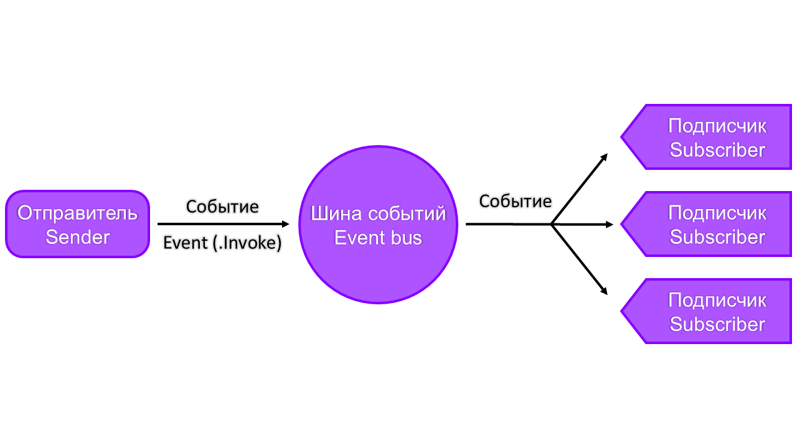

# Принцип работы архитектуры программы
Главная задача много потока - отделить операции с хардваирной частью от софтваирной  
Поэтому все обращение к хардваиру и его частичная обработка вынесены в 3 потока:

- **Control hub**
- **Expansion hub**
- **Camera**

Соединение софтваирной части к хардваирной происходит с помощью **заранее созданного объекта HardwareLink.**  
Код делится на модули - один модуль привязан к одному физическому модулю.  
(Например колёсной базе соответствует модуль _DriveTrain_) 

Модуль должен выполнять определенную чёткую задачу.   
Чтобы создать модуль надо создать класс, который будет реализовывать интерфейс **IModule**:

- **process()** вызывается когда привязанный хардваирный поток обновляется и при этом модуль не занят.  
(**Важно** учитывать что в этой функции должно быть как можно меньше операций,  
потому что скорость обработки этой функции должна быть быстрее ветка привязанного потока,  
поэтому советуется запустить куратину которая уже будет делать что-то долгое)
- **isBusy** - флаг о том что модуль занят вычислениями, поэтому он пропустит одно обновление привязанного хардваирного потока
- **dispose()** - вызывается тогда, когда происходит полный перезапуск робота -  
  в этот момент **надо освободить все занятые ресурсы**, которые могут создать утечку памяти / потока

Пример реализации:

```Kotlin
class MyModule: IModule {
    private var _currentJob: Job? = null  // Отслеживание текущей задачи

    override fun process() {
        _currentJob = ThreadManager.LAZY_INSTANCE.globalCoroutineScope.launch {  // Запрос и запуск куратины
            delay(1000)  // Долгое действие
        }
    }

    override val isBusy: Boolean
        get() = _currentJob != null && !_currentJob!!.isCompleted  // Проверка на то что задача еще не закончена

    override fun dispose() {
        _currentJob?.cancel()  // Освобождение ресурсов
    }
}
```

Для того что, чтобы _привязать_ модуль к хардваирному потоку и в целом сделать модуль активным, надо:  
1) В классе [HardwareThreads](../TeamCode/src/main/kotlin/org/woen/threading/hardware/HardwareThreads.kt)
   **в методе initModules()** выбрать нужный хардваирный поток (допустим CONTROL)  
3) Обратится к его линковщику **(.link)**  
4) Вызвать метод **addModules(..)**, где через запятую перечислить инстанцы модулей.

Пример:

```Kotlin
fun initModules() {
    CONTROL.link.addModules(MyModule())
}
```

##### Там же можно включать / отключать модули.


---


# Вспомогательные системы
В проекте есть много вспомогательных систем: 
- [ThreadManager](https://github.com/WoEN239/Decode18742/blob/master/docs/architecture.md#threadmanager)
- [HotRun](https://github.com/WoEN239/Decode18742/blob/master/docs/architecture.md#hotrun)
- [ThreadedTimers](https://github.com/WoEN239/Decode18742/blob/master/docs/architecture.md#threadedtimers)
- [ThreadedGamepad](https://github.com/WoEN239/Decode18742/blob/master/docs/architecture.md#threadedgamepad)
- [ThreadedEventBus](https://github.com/WoEN239/Decode18742/blob/master/docs/architecture.md#threadedeventbus)
- [ThreadedBattery](https://github.com/WoEN239/Decode18742/blob/master/docs/architecture.md#threadedbattery)
- [ThreadedTelemetry](https://github.com/WoEN239/Decode18742/blob/master/docs/architecture.md#threadedtelemetry)
  
Все они реализованы с помощью LAZY_INSTANCE - их синглтон инстанц будет создан при первом обращении к нему.  
По названию систем понятно что **они потокобезопасны и их можно использовать где угодно.**

## ThreadManager
Система, которая автоматизирует освобождение ресурсов потоков.  
Чтобы поток автоматически закрылся его надо зарегистрировать в менеджере: 
```kotlin
ThreadManager.LAZY_INSTANCE.register(поток)
```

Так же в нём есть пространство для куратин: 

```kotlin
ThreadManager.LAZY_INSTANCE.globalCoroutineScope.launch {
    // Код в куратине
}
```


---


## HotRun
Данная система ускоряет запуск опмода по средством того что
большая часть созданных потоков / обьектов не пересоздаётся для нового запуска.

В системе есть:
- **currentRunState(стоп, инит, работа)** - тякущее состояние программы
- **currentRunMode(ручной, автоном)** - текущий режим запуска
  
Так же можно подписаться на евенты опмода через [утилиту SimpleEvent](https://github.com/WoEN239/Decode18742/blob/master/docs/architecture.md#simpleevent)
- **opModeInitEvent**
- **opModeStartEvent**
- **opModeUpdateEvent**
- **opModeStopEvent**


---


## ThreadedTimers
Система позволяет запустить действие, которое выполнится через какое-то время / событие / таймаут, пример:

```Kotlin
ThreadedTimers.LAZY_INSTANCE.startTimer(ThreadedTimers.Timer(5.0) {  // Старт таймера на 5 секунд
    // Действие которое выполнится через 5 секунд
})

ThreadedTimers.LAZY_INSTANCE.startTimer(ThreadedTimers.SupplerTimer({условие}, {  // Старт таймера до момента когда условие станет истинным
    // Действие
}))

ThreadedTimers.LAZY_INSTANCE.startTimer(ThreadedTimers.SupplerTimer({условие}, {  // Старт таймера до момента истечения времени или того момента когда условие станет истинным
                                                                                  // Фактически таймер с таймаутом
    // Действие
}, 5.0))
```


---


## ThreadedGamepad
Система для получения доступа к геймпаду, посредству добавления слушателей (Listener) разного типа к нему, пример:

```Kotlin
ThreadedGamepad.LAZY_INSTANCE.addListener(ThreadedGamepad.createClickDownListener({it.circle}, {  // Добавление слушателя который однократно среагирует
                                                                                                  // когда круг на геймпаде будет нажат
    // Действие
}))
```

Слушатели бывают разных типов:
- **createHoldUpListener** - постоянно вызывается когда кнопка **не нажата**
- **createHoldDownListener** - постоянно вызывается когда кнопка **нажата**
- **createClickUpListener** - однократно вызывается когда кнопка менят свое состояние на **не нажатое**
- **createClickDownListener** - однократно вызывается когда кнопка менят свое состояние на **нажатое**
- **createAnalogListener** - постоянно вызывается, нужно для тех кнопок у которых **больше 2-х состояний**


---


## ThreadedEventBus
Система, которая нужна для связи модулей по средствам евентового паттерна.  
У нас есть какой-то евент - у него есть подписчики и его можно вызвать, затригерив всех его подписчиков  



Пример:

```Kotlin
class ExampleEvent(val testParameter: Double)  // Пример евента

ThreadedEventBus.LAZY_INSTANCE.subscribe(ExampleEvent::class, {  // Подписчик 1
    // Действие 1 при выполнении евента
})

ThreadedEventBus.LAZY_INSTANCE.subscribe(ExampleEvent::class, {  // Подписчик 2
    // Действие 2 при выполнении евента
})

ThreadedEventBus.LAZY_INSTANCE.invoke(ExampleEvent(5.0))  // По очереди произойдут действие 1, потом действие 2
```


---


## ThreadedBattery
Система аккумулятора, позволяет узнать текущее напряжение: 
```kotlin
ThreadedBattery.LAZY_INSTANCE.currentVoltage
``` 

Или преоброзовать напряжение (вольтаж) в питание на мотор: 
```kotlin
ThreadedBattery.LAZY_INSTANCE.voltageToPower(питание: Double)
```


---


## ThreadedTelemetry
Система многопоточной телеметрии, с помощью неё можно:
- Отправлять строку в лог: 
  ```kotlin
  ThreadedTelemetry.LAZY_INSTANCE.log(строка)
  ```
  
- Постоянно посылать что-то в телеметрию драйвер хаба или дэшборд:
  ```kotlin
  ThreadedTelemetry.LAZY_INSTANCE.onTelemetrySend += {
      it.addData("name", 5.0)
  }```
  
- Посылать что-то в телеметрию на протяжении какого-то времени: 
  ```kotlin
  ThreadedTelemetry.LAZY_INSTANCE.startTemporarySender(ReversedElapsedTime(5.0)) {
      it.addLine("example line")  // Шлет line 5 секунд
  }```


Функции того что можно отправлять в телеметрию:
- **addLines** - шлет строку
- **addData** - шлет значение в формате название: дата
- **drawCircle** - рисует круг в дэшборде
- **drawPolygon** - рисует многоугольник в дэшборде
- **drawRect** - рисует прямоугольник с поворотом и позиционированием относительно центра

У робота есть файл конфигов - _ThreadedConfigs_, в них можно добавлять любые значения 2х видов:
- **AtomicValueProvider** - просто число
- **AtomicEventProvider** - число с евентом изменения переменной,

Чтобы конфиг добавился в дэшборд надо пометить его анотацией **ThreadedConfig** в _category_ - вкладка в которой будет конфиг,  
а _name_ (по-умолчанию такое же как имя переменной) отвечает за имя конфига в дэшборде.


---


# Утилиты
Утилиты упрощают базовые действия, они не синглтоновские, а представляют обычные классы, часто не защищеные для многопоточных действий

## SimpleEvent
Простой евент на инстанц которого можно подписаться или вызвать

## ExponentialFilter
Экспоненциальный фильтр, позволяет фильтровать или совмещать значения с датчиков

## Regulator
Регулятор с большим количеством настроек, пример:

```Kotlin
val regulator = Regulator(RegulatorParameters(kP = 5.0))  // Создание П регулятора
regulator.start()
        
motor.power = regulator.update(ThreadedBattery.LAZY_INSTANCE.voltageToPower(err))  // Обновление регулятора и подача управляющего воздействия
```

## ElapsedTime, ElapsedTimeExtra, ReversedElapsedTime
сбрасываемые и останавливаемые часы / таймер, пример использования:

```Kotlin
val time = ElapsedTime()
time.reset()

time.seconds()

val extraTime = ElapsedTimeExtra()
extraTime.reset()

extraTime.pause()

extraTime.seconds()

extraTime.start()

val reversedTime = ReversedElapsedTime()
reversedTime = resetWithStartSeconds(5.0)

reversedTime.seconds()
```

## UpdateCounter
Считает количество обновлений в секунду

## Vec2, Angle, Color, Orientation
Типы данных с большим количеством операций


---


# Создание хардваирных устройств
Чтобы сделать своё хардваирное устройство надо создать класс, **реализующий интерфейс IHardwareDevice и его методы:**
- **update()** - вызывается при обновлении устройства в хардваирном потоке
- **init(HardwareMap)** - инициализация устройства

Чтобы добавить устройство в список обновлений надо в модуле написать: 
```kotlin
HardwareThreads.LAZY_INSTANCE.CONTROL.addDevices(инстанцы устройств через запятую)
```


При разработки хардаирного устройства **важно учитывать потокобезопасность**


---